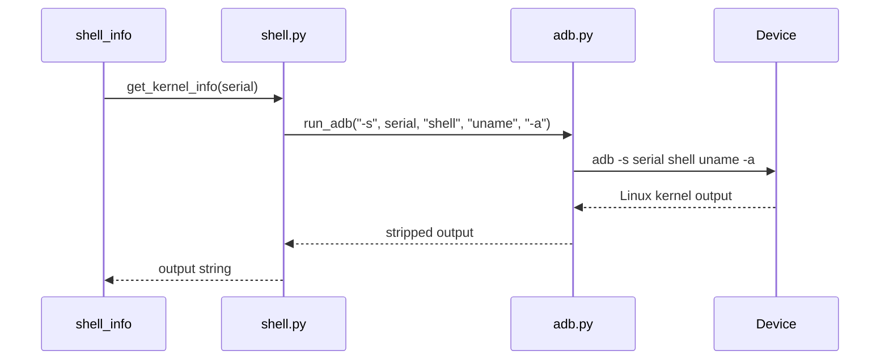

# Architecture

Android Cookbook uses a small layered design: application workflows call focused ADB or shell
helpers, and the local ADB client/server communicates with an emulator or physical device.

```text
device_info.py / shell_info.py  Application workflows and JSON presentation
              |
              v
         shell.py               Shell command and inspection helpers
              |
              v
           adb.py               ADB execution, parsing, and getprop
              |
              v
       subprocess.run           Operating-system process boundary
              |
              v
adb client -> adb server -> Emulator or physical Android device
```

## Components

### `src/android_cookbook/adb.py`

- `AdbDevice` is an immutable dataclass with `serial` and `state`.
- `run_adb(*args)` executes `['adb', *args]` with captured text output and `check=True`, then
  returns stripped stdout.
- `list_devices()` skips the `adb devices` header and empty or malformed rows, returning
  `list[AdbDevice]` while retaining states such as `device`, `offline`, and `unauthorized`.
- `get_property()` invokes `adb -s <serial> shell getprop <property>`.

Non-zero commands propagate `subprocess.CalledProcessError`; a missing executable propagates
`FileNotFoundError`.

### `src/android_cookbook/device_info.py`

This workflow selects the first device whose state is `device`, reads properties, and prints
indented JSON. With no online device it raises `RuntimeError("No Android device available")`.

| JSON field | Android property |
| --- | --- |
| `serial` | Supplied by `adb devices` |
| `model` | `ro.product.model` |
| `android_version` | `ro.build.version.release` |
| `sdk` | `ro.build.version.sdk` |
| `build` | `ro.build.id` |

### `src/android_cookbook/shell.py`

This module builds on `run_adb()` to provide a typed shell boundary.

- `ShellResult` is immutable and contains joined command text plus stripped output.
- `run_shell(serial, *command)` invokes `adb -s <serial> shell <command...>`.
- `get_working_directory()` runs `pwd`.
- `get_current_user()` runs `whoami`.
- `get_kernel_info()` runs `uname -a`.
- `list_root_directory()` runs `ls /` and returns stripped, non-empty lines.
- `ProcessInfo(user, pid, name)` is defined for future process parsing but is unused.

Commands are separate tokens. `run_shell(serial, "uname", "-a")` records
`command="uname -a"` and delegates `adb -s <serial> shell uname -a`.

### `src/android_cookbook/shell_info.py`

The v0.2 workflow selects the first online device and prints its serial, shell user, working
directory, kernel information, and root-directory entries as JSON. It shares the no-device error
with `device_info.py`.

The current source has a known wiring defect: `cwd` calls `get_kernel_info()` instead of
`get_working_directory()`, so current JSON duplicates the kernel output.

## Shell runtime flow



## Test architecture

| Layer | Files | Boundary | Coverage |
| --- | --- | --- | --- |
| Unit | `tests/unit/test_adb.py`, `test_shell.py` | Mocked `subprocess.run` or `run_adb` | Parsing, arguments, trimming, shell transformations |
| Integration | `tests/integration/test_device.py`, `test_shell.py` | Real ADB and device | Detection, SDK, user, kernel, root entries |

Integration modules use `pytestmark = pytest.mark.integration`. Device-dependent checks skip
when no device has state `device`.

## Current constraints

- Device selection is fixed to the first online device.
- Commands have no timeout or domain-specific error translation.
- Property and most shell values are strings.
- `shell_info.py` fills `cwd` with kernel information.
- `ProcessInfo` is unused, and there is no CLI argument parsing.
