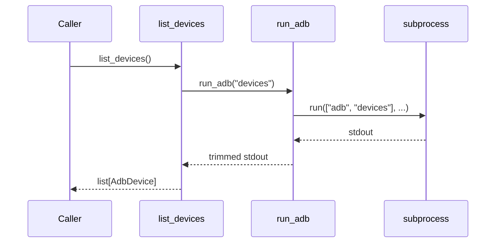
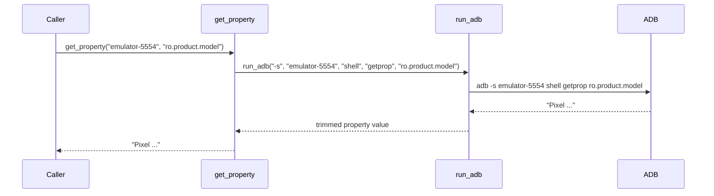
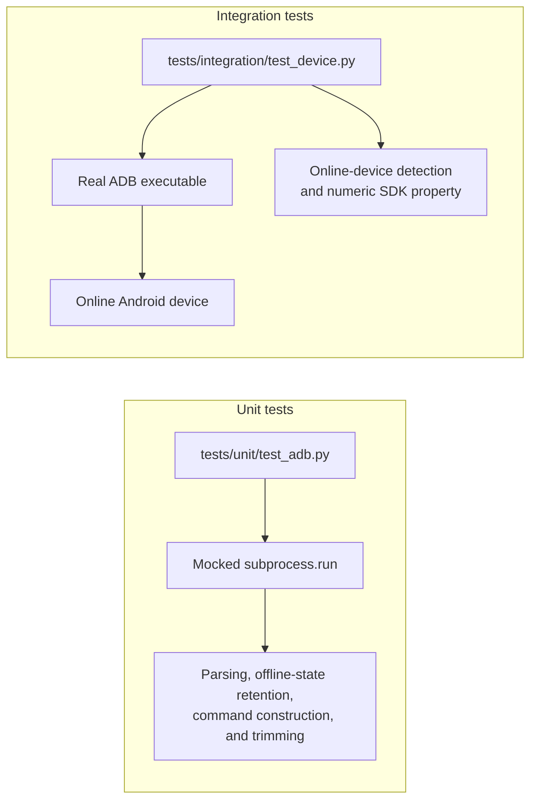

# Architecture

Android Cookbook uses a small layered design: the Python application builds ADB commands, the
local ADB client communicates with its server, and the server talks to an emulator or physical
device.

```text
User / pytest
      |
      v
device_info.py              Application workflow and JSON presentation
      |
      v
adb.py                      Command execution and ADB output parsing
      |
      v
subprocess.run              Operating-system process boundary
      |
      v
adb client -> adb server -> Emulator or physical Android device
```

## Components

### `src/android_cookbook/adb.py`

This module is the boundary between Python and the ADB executable.

- `AdbDevice` is an immutable dataclass with `serial` and `state` fields. The `state` field holds
  values such as `device`, `offline`, or `unauthorized`.
- `run_adb(*args)` creates `['adb', *args]`, executes it with captured text output and
  `check=True`, strips surrounding whitespace, and returns stdout.
- `list_devices()` runs `adb devices`, skips its header and empty/malformed lines, and maps each
  remaining row to `AdbDevice`.
- `get_property(serial, property_name)` targets one serial and invokes
  `adb -s <serial> shell getprop <property>`.

Because `check=True` is used, a non-zero ADB exit code propagates as
`subprocess.CalledProcessError`. A missing executable propagates as `FileNotFoundError`.

### `src/android_cookbook/device_info.py`

This module contains the first application workflow.

1. `list_devices()` obtains all reported devices.
2. Devices whose connection state is not exactly `device` are excluded.
3. The first online device is selected.
4. `collect_device_info()` reads model, Android release, SDK level, and build ID.
5. `main()` prints the resulting dictionary as indented JSON.

If there is no online device, the workflow raises `RuntimeError("No Android device available")`.

The properties currently queried are:

| JSON field | Android property |
| --- | --- |
| `serial` | Supplied by `adb devices` |
| `model` | `ro.product.model` |
| `android_version` | `ro.build.version.release` |
| `sdk` | `ro.build.version.sdk` |
| `build` | `ro.build.id` |

## Runtime flows

Listing devices:



Reading a property:



## Test architecture



Unit tests should define the stable contract of `adb.py`; integration tests verify the same
contract across the workstation/ADB/device boundary. Integration tests are marked `integration`
and may be skipped when no online device is available.

## Current constraints

- Device selection is fixed to the first online device.
- Commands have no explicit timeout.
- stderr is captured but not translated into domain-specific errors.
- Property values are represented as strings.
- The current unit tests expect dictionary-shaped devices with `name` and `state` keys, but the
  implementation returns `AdbDevice(serial=..., state=...)`. This contract must be unified.
- One mocked property test constructs its result incorrectly, and one integration test compares
  against the misspelled state `deivce`.
- The project has no CLI argument parsing yet.

These constraints keep version 0.1 focused on the smallest useful ADB abstraction.
