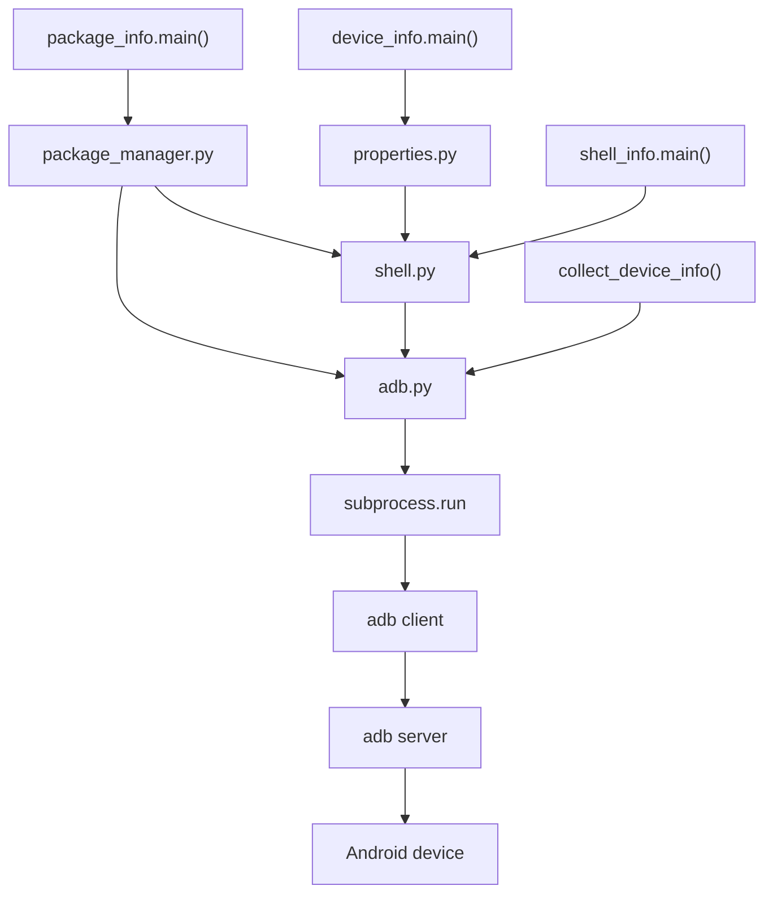

# Architecture

The Python modules build ADB commands, parse their output, and print device reports as JSON.
All device commands pass through `run_adb()` in `adb.py`, which starts the local ADB client.


```mermaid
flowchart TD
    DeviceInfo["device_info.main()"] --> Properties["properties.py"]
    PackageInfo["package_info.main()"] --> PackageManager["package_manager.py"]
    PackageManager --> Shell
    PackageManager --> Adb
    Properties --> Shell["shell.py"]
    ShellInfo["shell_info.main()"] --> Shell
    Shell --> Adb["adb.py"]
    CollectDeviceInfo["collect_device_info()"] --> Adb
    Adb --> Subprocess["subprocess.run"]
    Subprocess --> Client["adb client"]
    Client --> Server["adb server"]
    Server --> Device["Android device"]
```


The diagram shows property, shell, and package command paths. All three `main()` functions also call
`adb.list_devices()` to choose the first device whose state is `device`.

## Modules

| Module | Responsibility |
| --- | --- |
| [`adb.py`](../src/android_cookbook/adb.py) | Run ADB, list devices, and provide the original property reader |
| [`shell.py`](../src/android_cookbook/shell.py) | Run commands on a selected device and parse shell output |
| [`package_manager.py`](../src/android_cookbook/package_manager.py) | Query packages and APK paths; install, uninstall, clear, enable, and disable apps |
| [`package_info.py`](../src/android_cookbook/package_info.py) | Select a device and print a package report as JSON |
| [`properties.py`](../src/android_cookbook/properties.py) | Read and parse properties; collect a device report |
| [`device_info.py`](../src/android_cookbook/device_info.py) | Select a device and print its properties as JSON |
| [`shell_info.py`](../src/android_cookbook/shell_info.py) | Select a device and print shell information as JSON |

### ADB execution

`run_adb(*args)` calls `subprocess.run(["adb", *args], capture_output=True, text=True,
check=True)`. It returns standard output with surrounding whitespace removed.

`list_devices()` reads `adb devices` output. It skips the header, blank lines, and rows with
fewer than two columns. Each accepted row becomes an `AdbDevice(serial, state)`.
Offline and unauthorized devices remain in the list; callers decide which state to use.

### Shell commands

`run_shell(serial, *command)` adds `-s <serial> shell` before the command arguments.
For example:

```python
run_shell("emulator-5554", "uname", "-a")
```

runs `adb -s emulator-5554 shell uname -a` and returns a `ShellResult` with two fields:

- `command`: the arguments joined with spaces, such as `uname -a`.
- `output`: the text returned by `run_adb()`.

The joined string is for display. Process execution uses the argument list.

| Helper | Command | Result |
| --- | --- | --- |
| `get_working_directory()` | `pwd` | String |
| `get_current_user()` | `whoami` | String |
| `get_kernel_info()` | `uname -a` | String |
| `list_root_directory()` | `ls /` | List of stripped, non-empty lines |

### Property reads

`properties.get_property(serial, name)` runs `getprop <name>` through `run_shell()` and
strips its output. `get_all_properties(serial)` runs `getprop` once and parses the listing.

`collect_device_properties(serial)` makes eight separate property reads and returns
`DeviceProperties`. It converts `sdk_level` with `int()` and leaves the other values as
strings. It does not cache results or use the bulk listing. See the
[property reference](receipes/v0.3-properties.md#common-properties) for field mappings.

The older `adb.get_property(serial, property_name)` calls `run_adb()` directly. It remains
in use by `collect_device_info()` and the v0.1 tests.

### Property parsing

The parsing functions do not call ADB:

- `parse_properties(output)` strips each line, skips blank lines, and calls
  `parse_property_line()`. It keeps accepted entries in order, including duplicate names.
- `parse_property_line(line)` requires a leading `[` and the exact separator `]: [`.
  It splits at the first separator, removes the opening bracket from the name, and removes
  a final `]` from the value if present. It returns `None` when either initial check fails.

The parser accepts empty names, empty values, and missing closing brackets. When called
directly, `parse_property_line()` does not strip surrounding whitespace.

`AdbDevice`, `ShellResult`, `AndroidProperty`, and `DeviceProperties` are frozen dataclasses:
their fields cannot be reassigned after creation. `ProcessInfo` is also defined in `shell.py`
but is not used.

### Package management

`list_packages()` builds `pm list packages` with optional `-s`, `-3`, `-e`, `-d`, and a
name filter, then calls `run_shell()`. Mutually exclusive system/third-party or
enabled/disabled filters raise `ValueError` before execution. `package_exists()` uses the
filtered listing and compares full names for an exact match.

`parse_package_line()` strips whitespace and requires `package:` followed by a non-empty
name. `parse_package_list()` skips rejected lines and preserves order and duplicates.
`parse_package_paths()` applies the same prefix and non-empty checks to paths and returns
`PackagePath(package_name, paths)`, including all split APK paths. These parsers do not
validate package-name syntax or check whether a path exists.

`get_package_path()`, `clear_package()`, `enable_package()`, and
`disable_package_for_user()` issue `pm` commands through `run_shell()`. Clear returns a
Boolean based on an exact `Success` response; enable and disable return stripped output.
Only the disable helper exposes `user_id`, defaulting to `0`.

`install_apk()` checks that the host path exists, then calls `run_adb()` with
`-s <serial> install`, optional `-r` and `-g`, and the path. `uninstall_package()` calls
`run_adb()` with `-s <serial> uninstall`, optional `-k`, and the package name.
Both return stripped standard output. They do not catch command failures.

`PackageInfo` and `PackagePath` are frozen dataclasses. Fields cannot be reassigned,
though the list stored in `PackagePath.paths` can still be modified.
See the [package recipe](receipes/v0.4-package-manager.md) for commands and return values.

## JSON commands

All three entry points select the first online device. If none is available, they raise
`RuntimeError("No Android device available")`.

`device_info.main()` calls `collect_device_properties()`, converts the result with `asdict()`,
adds `serial`, and prints indented JSON. The output includes the integer field `sdk_level`.
See the [JSON example](receipes/v0.3-properties.md#4-print-json).

The older `collect_device_info()` helper returns string fields `serial`, `model`,
`android_version`, `sdk`, and `build`. The entry point no longer calls it.

`shell_info.main()` prints `serial`, `user`, `cwd`, `kernel`, and `root_directories`.
It currently calls `get_kernel_info()` for both `cwd` and `kernel`, so those fields contain
the same kind of output. The working-directory helper is implemented but is not called here.

`package_info.main()` requires `--package`, selects an online device, and calls
`package_exists()`. It reads paths only for an installed package and prints `serial`,
`package`, `installed`, and `apk_paths`. An absent package has `installed: false` and an
empty path list. See the [package JSON example](receipes/v0.4-package-manager.md#3-print-a-package-report).

## Error handling

Errors pass through to the caller:

| Condition | Exception |
| --- | --- |
| ADB executable is missing | `FileNotFoundError` |
| ADB exits with a non-zero status | `subprocess.CalledProcessError` |
| APK path does not exist on the workstation | `FileNotFoundError` |
| Package filters conflict | `ValueError` |
| Required `--package` argument is omitted | `argparse` exits with status 2 |
| SDK output cannot be converted to an integer | `ValueError` |
| A JSON command finds no online device | `RuntimeError` |

ADB calls have no timeout. The JSON commands have no option for choosing a serial;
the Python helpers accept one explicitly.

## Tests

Unit tests replace process or device calls with sample responses. Integration tests run
ADB against the first online device.

| Test file | Checks |
| --- | --- |
| `tests/unit/test_adb.py` | Device parsing, offline state, and property command arguments |
| `tests/unit/test_shell.py` | Shell arguments, result fields, user, working directory, and root entries |
| `tests/unit/test_properties.py` | Property parsing, read arguments, output trimming, and collection with an integer SDK |
| `tests/unit/test_package_manager.py` | Package parsing, list arguments, conflicting filters, existence, APK paths, clear responses, install options, missing APKs, and basic uninstall |
| `tests/integration/test_package_manager.py` | Package listing, Settings existence and APK paths, and system packages |
| `tests/integration/test_device.py` | Device discovery and numeric SDK output |
| `tests/integration/test_shell.py` | Shell user, Linux kernel output, and a `system` root entry |
| `tests/integration/test_properties.py` | Model, SDK, Android version, property listing, and collected report |

Integration modules use `pytest.mark.integration` and skip if no device is online.
Missing ADB or failed commands cause errors.

The suite does not directly test the JSON entry points, SDK conversion failures, or every
malformed property format. The bulk-property unit test checks parsed output but does not
assert command arguments. For commands to run the tests, see [Run tests](../README.md#run-tests).

Package integration tests only query device state and assume `com.android.settings` exists.
They do not test app mutations. Package unit tests do not directly cover enable/disable,
enabled/disabled flag construction, exact-name versus substring matching, or uninstalling
with `keep_data=True`. The package JSON entry point is also untested.
